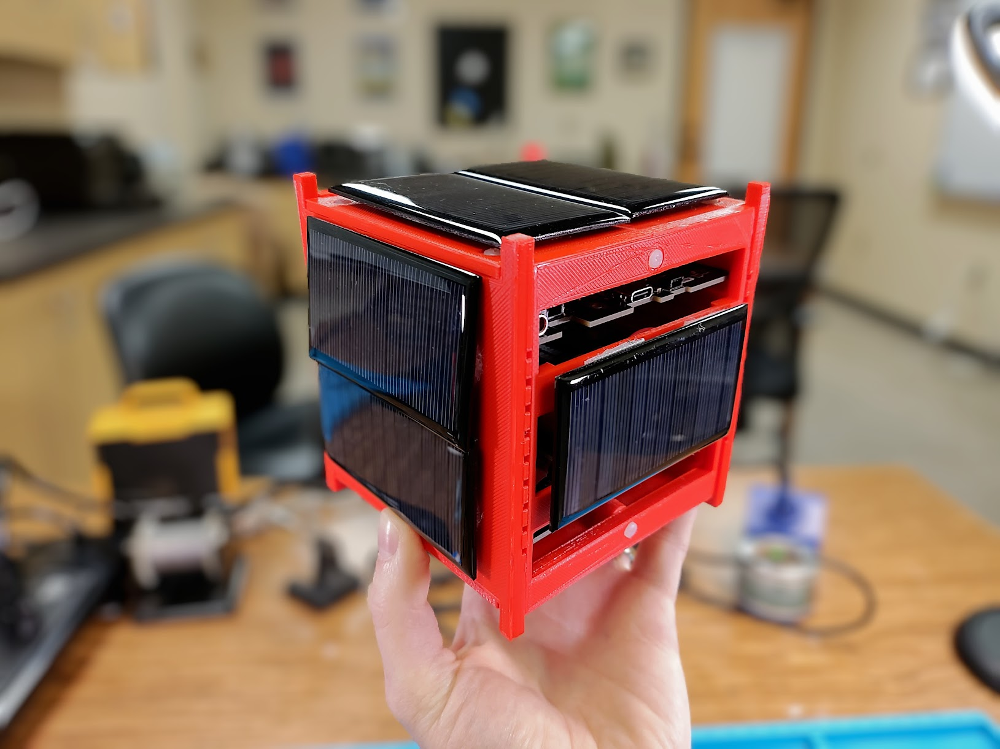

# Welcome to MOSAIC

MOSAIC, or "Modular Orbital Satellite for Advanced Innovation and Curriculum", is an open-source, modular satellite platform designed to advance space technology education and accelerate satellite mission design.

MOSAIC is a demonstrator satellite, or “mocksat,” that uses commercial off-the-shelf (COTS) components and a modular hardware ecosystem to make satellite technology accessible, affordable, and adaptable for educational institutions and research teams.

## Learn More

[Visit MOSAIC's website](https://www.mosaicsat.org/) to learn more about the platform and read its documentation. 

MOSAIC's website covers:
- What MOSAIC is and all its components
- How to get your own MOSAIC
- How to use MOSAIC

## Open-Source Repositories

This GitHub page for MOSAIC contains all of the satellite's open-source files and documentation. Here, you can find everything you need to make and use your own MOSAIC satellite. 

Open-source also means you can contribute to the further development of MOSAIC! We encourage anyone interested to contribute to the MOSAIC GitHub repositories. 